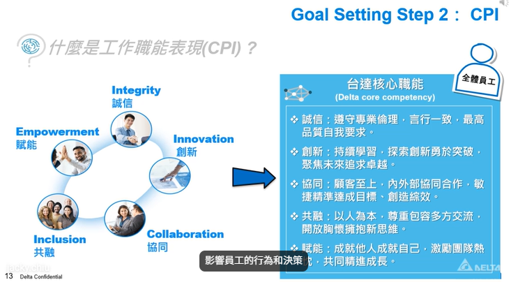
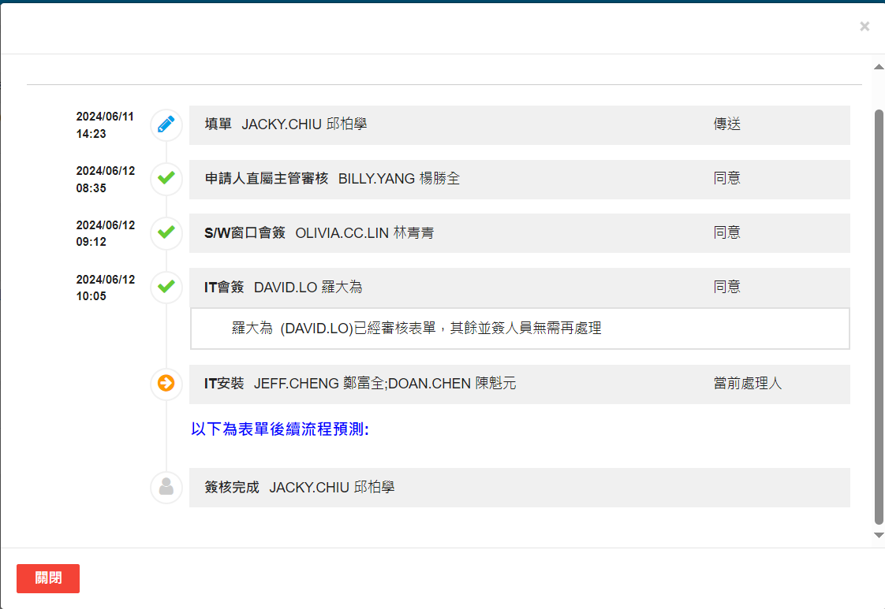
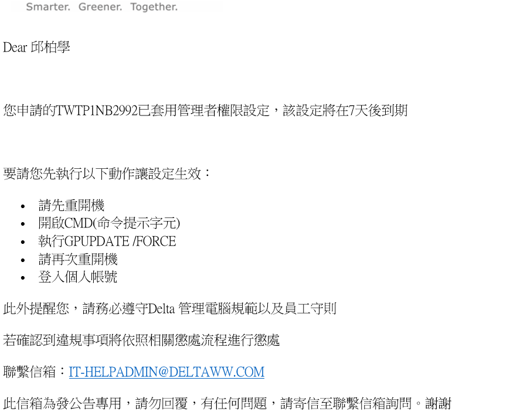
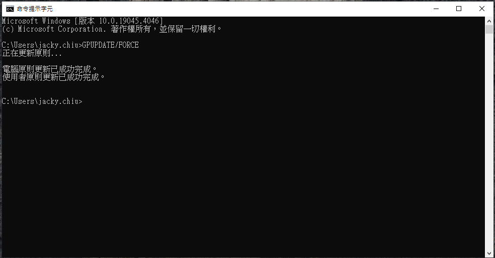
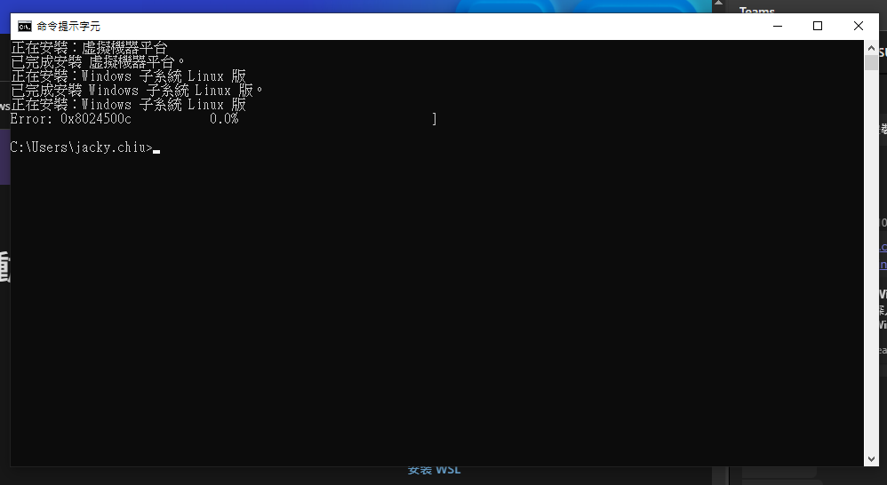
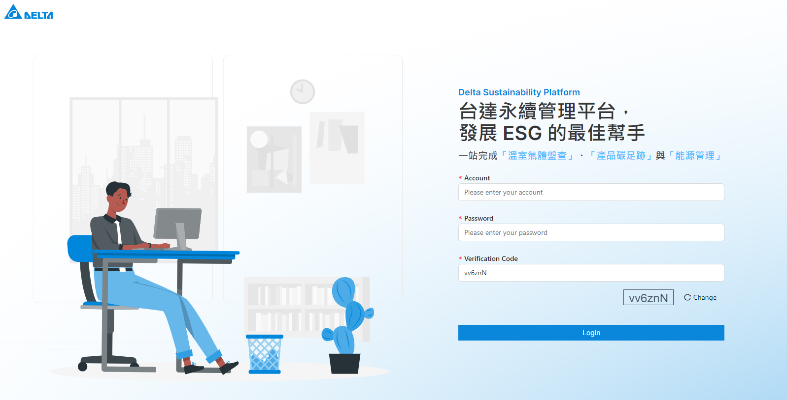
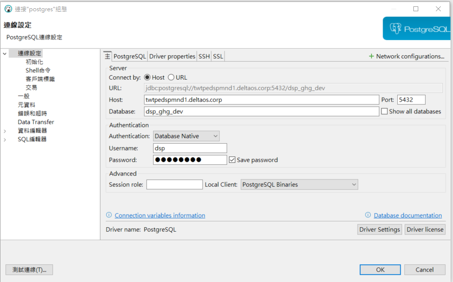
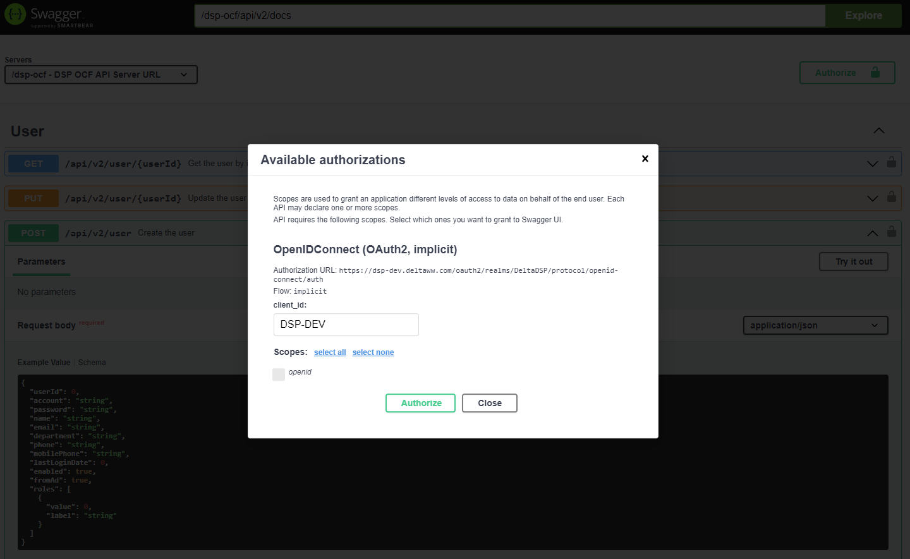

**預覽快捷鍵** `ctrl+shift+v` 
**休眠快捷鍵** `win+x U S` 
**螢幕截圖** `win+shift+s` 
**工號:**  906721

**誠信、創新、協同、共融、賦能** 

  - [ ] [test.md](./test.md)
  
- 專案相關
  - [ ]  IBM Rational 申請安裝[申請中還沒回到我身上] [link](https://dgoa.deltaww.com/SmartFormV2/index.html?FlowCode=2297&InstanceCode=2024060089942&ToCode=1)
    - 
  - [ ]  電腦權限申請[已開啟]: 要再詢問說要做什麼 => 為的是要安裝 Rancher K8s [link](https://dgoa.deltaww.com/SmartFormV2/index.html?FlowCode=2644&InstanceCode=2024060090133&ToCode=1)
    - 
    - 執行 GPUPDATE/FORCE
    - 
    -  [ ] 要先安裝 WSL Windows Subsystem for Linux (是裝在windows裡面的Linux core)
    -  使用指令安裝會發生錯誤，要改用舊版
    - 
    - Ubutu username: jacky_chiu p@ssw0rk: 1qaz@WSX
    - [舊版 WSL 的手動安裝步驟](https://learn.microsoft.com/zh-tw/windows/wsl/install-manual)
      - 我有卡在兩個地方，一個是沒有下載步驟 4 的 下載 Linux 核心更新套件
      - 另外一個是手動安裝 Ubuntu 拉下來的時候是 AppxBundle
  - [x]  Local Build GHG 專案 [db 連線防火牆還沒開]
    - [x]  連接 DB [db 已經開了，這部分是請 Chance 協助開立]
  - [ ]  看文件 [DSPBD](https://confluence.deltaww.com/display/ITDSPBD/DSPBD)
  - [ ]  DevOps [DevOps](https://confluence.deltaww.com/display/ITDSPBD/DevOps)
  - [ ]  GHG 前端永續管理平台 [DSP 台達永續管理平台](https://dsp-dev.deltaww.com/oauth2/realms/DeltaDSP/protocol/openid-connect/auth?client_id=DSP-OCF&redirect_uri=https%3A%2F%2Fdsp-dev.deltaww.com%2Focfweb%2Fzh-tw%2Fhome%2Fwelcome&response_type=code&scope=openid&state=cec045d262bb4b26aad7c85dcbbbd856&code_challenge=jVWdMl-_v0IP1HVu-5ng4yFkOGoJhapGD0jRSQyWwwc&code_challenge_method=S256&response_mode=fragment&ui_locales=zh-tw)
    - 
  - [ ]  keycloak [keycloak](https://www.keycloak.org/)
  - [ ]  GHG 的 Admin 帳號: admin / adminp@ssw0rd
  - [x]  dsp-ocf branch: develop
  - [x]  dsp-security branch: master
  - [ ]  測試區 DB 連線截圖 
  - [ ]  CMD 確認 DB 連線: `telnet twtpedspmnd1.deltaos.corp 5432`
  - [ ]  SWAGGER 直接驗證 client_id 直接輸入 DSP-DEV
  - [ ]  專案結構 [test.md](./test.md)
- 專案團隊相關
  - [x] 座位表
  - [ ] 三大系統 RD 週會，每周二早上 9:30~10:30
  - [ ] GHG 內部週會，每周四早上 13:30~14:30

spring cloud FeignClient
在 cloud 中發送其他 為服務的設定
oidc open ID connection: keycloack

Azur 帳號

adapter 內部或外部系統
db 
rest
model

common json 

新刪修查 遵照 restful

get, delete, put, post

@ActivityLogger

log stash -> log4j

company 據點圖片 存 BASE64 

COEFFICIENT 全域係數資料庫 >> PCF >> 先不管

GHG 係數列表

Coeffiction page

db entity 去接 

刪除 都是軟刪除 改狀態 用 ENUM

@Enumerated

@Page
repository pageable

service 要寫 interface

加班

enum

converter

mapstruct @Mapper spring uses = {Z}

entity > convert 不要改到convert implement 的東西

ISignOffActivity

validator

aggregator??
聚合的情境??

據點資料

decorator

factory 工廠模式

gHG 的排放數量

emitEvent

executor

generator 統計資料

impl
AbstractPageService 抽象層

emission 排放源

crudservice
pageservice會用到

processor 活動進度處理器 排放源進度處理器

我們有排程嗎?

utils

i18n

commonException

Dion Exception 

db 也有做 i18n

scope, scope name, 

company
city
city_name (i18n 複合鍵)

country_market
country_market_name3

iso 跟 ghg

Add-AppxPackage .\Ubuntu2204-221101.AppxBundle

Invoke-WebRequest -Uri https://aka.ms/wslubuntu2204 -OutFile Ubuntu.appx -UseBasicParsing

docker run --name some-postgres -e POSTGRES_PASSWORD=p@ssw0rk -p 5432:5432 -d postgres

6/17 PO 會議
esg data platform 問券

有跟據點相關的數據嗎?

排放源
原(燃)物料

就可以對出來係數

mapping 的疑慮?有多重可能性嗎?
1. 係數版本??
2. 時間會影響對應的係數版本
3. 或是讓他是可以選擇係數的版本

環保署

日本

係數關聯表??

- 台達
  - 專案
    - GHG
  - 新人
    - 

1. 其他系統的錯誤情境，一定都會是 httpstatus 錯誤的情境? 不會有實際回傳 200，但意義上還是錯誤情境嗎?
2. 

2024/06/19

溫室氣體年排放量

2024/07/02

simapro gabi 研究型數據資料庫

ghg: ipcc, 環境部門 scope 1, 2

一級資料交換平台 Together for Sustainability, Catena-X

sigreen

台達在供應鏈裡面

**PACT 規範** 資料庫的憲法

專案 or 產品 兩個都做!

內部: 永續部

排程 spring batch

2024/07/03

我以為是資料面的討論，但聽起來有客戶需求端功能的討論

FMBG?