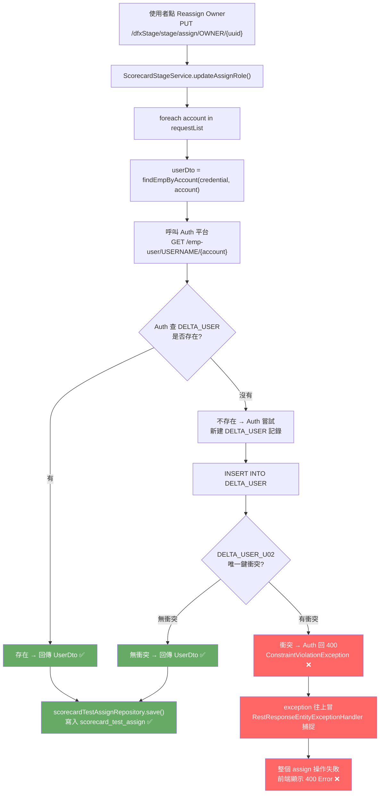

```Mermaid
flowchart TD
    A["使用者點 Reassign Owner\nPUT /dfxStage/stage/assign/OWNER/{uuid}"]
    B["ScorecardStageService.updateAssignRole()"]
    C["foreach account in requestList"]
    D["try {\n  userDto = findEmpByAccount(credential, account)\n}"]
    E["呼叫 Auth 平台\nGET /emp-user/USERNAME/{account}"]
    F{"Auth 查 DELTA_USER\n是否存在?"}
    G1["存在 → 回傳 UserDto ✅"]
    G2["不存在 → Auth 嘗試\n新建 DELTA_USER 記錄"]
    H["INSERT INTO DELTA_USER"]
    I{"DELTA_USER_U02\n唯一鍵衝突?"}
    J1["無衝突 → 回傳 UserDto ✅"]
    J2["衝突 → Auth 回 400\nConstraintViolationException ❌"]
    K["catch Exception\nlog.warn 記下帳號\n跳過此帳號繼續"]
    L["其他帳號繼續正常執行"]
    M["scorecardTestAssignRepository.save()\n寫入 scorecard_test_assign ✅"]
    N["送通知 mail ✅"]
    O["回傳 200 給前端 ✅"]

    A --> B --> C --> D --> E --> F
    F -->|"有"| G1 --> M
    F -->|"沒有"| G2 --> H --> I
    I -->|"無衝突"| J1 --> M
    I -->|"有衝突"| J2 --> K --> L --> M --> N --> O

    style J2 fill:#f99,color:#000
    style K fill:#2a2,color:#fff
    style G1 fill:#6a6,color:#fff
    style J1 fill:#6a6,color:#fff
    style M fill:#6a6,color:#fff
    style O fill:#6a6,color:#fff
```

